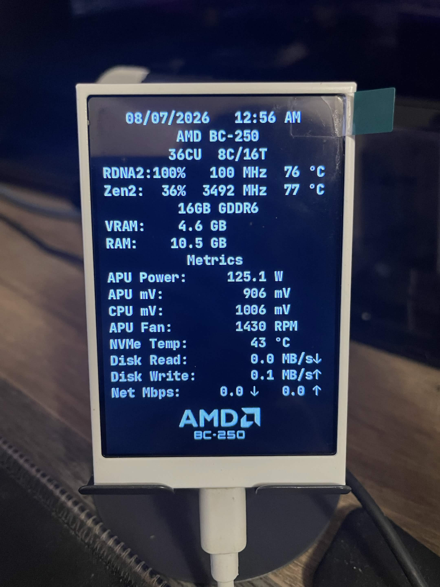

# bc250-custom-overlays
BC250 custom overlays collection. Made by [TMGHD272](https://www.youtube.com/TMGHD272)

A bunch of custom overlays/logos that I made for archival purposes that anyone can use.

## Table of Contents
- [Turzx Screen](#turzx-screen-fully-designed-for-bc250)
  - [Setup Tutorial](#setup-tutorial)
  - [What’s Included](#whats-included)
  - [startup.py Issues](#startuppy-issues)
- [MangoHud](#mangohud-designed-for-bc250)
  - [Setup Tutorial](#setup-tutorial-1)
  - [What’s Included](#whats-included-1)
- [BIOS Logo](#bc250-bios-logo)
  - [BC250 BIOS Logo](https://github.com/tmghd272/bc250-custom-bios-logo)

# Turzx Screen Fully Designed for BC250
A custom-made UI for the Turzx 3.5" screen that detects BC250 sensors:

- [download startup.py](turing-smart-screen/startup.py)

> **Note:** The displayed APU clock is intentionally incorrect due to a known `amdgpu` clock reporting issue after unlocking the BC250 CPU cores using [bc250-core-unlock](https://github.com/rw-r-r-0644/bc250-core-unlock).

## Setup Tutorial
### Prerequisites
* **nct6683** or **nct6687** *(APU Fan needs this).*
* **drivetemp** *(NVMe Temp needs this).*
* **Python**
* **pip**
* **turing-smart-screen-python**

If you haven’t set up your Turzx screen yet, watch this YT vid by [Old Lamer](https://www.youtube.com/watch?v=vTxWFS8VAcI&t) to set up [turing-smart-screen-python](https://github.com/mathoudebine/turing-smart-screen-python) for Bazzite systems.

* I also made a Toolkit for arch systems: https://github.com/tmghd272/bc250-turzx-config

(if needed, make sure to back up your original *startup.py*).

To install my custom overlay, simply put `startup.py` inside:
`/var/home/<username>/Apps/turing-smart-screen-python`

Optional* If you want my custom template background logo I showed in the preview as well, download it [here](turing-smart-screen/example_320x480.png) and simply put `example_320x480.png` inside:

`/var/home/<username>/Apps/turing-smart-screen-python/res/backgrounds`

Then replug the device or run:
`systemctl --user restart turing.service`

## What's Included

| Feature | Description |
| --- | --- |
| **Date and Time / BC-250 Specs** | Displays current date/time and BC-250 system information. |
| **CU / Cores / Threads** | Shows active Compute Unit count (live via [**CU-count passthru**](https://github.com/tmghd272/bc250-cu-count-passthru) if installed, otherwise the kernel's default/boot-time count via `vulkaninfo`), plus physical cores and logical threads from `/proc/cpuinfo`. |
| **APU Load, Clock, Temp** | Displays GPU utilization, clock (`pp_dpm_sclk`), and temperature (`temp1_input`). Load will always show 0% without the `cyan-skillfish` `gpu_metrics` fix applied. |
| **CPU Load, Clock, Temp** | Displays CPU utilization (`/proc/stat`), clock (`cpu MHz` in `/proc/cpuinfo`), and temperature via `k10temp` (`temp1_input`). |
| **VRAM** | Shows current APU VRAM usage (`mem_info_vram_used` + `mem_info_gtt_used`). |
| **RAM** | Shows current system RAM usage (`MemTotal` / `MemAvailable` in `/proc/meminfo`). |
| **APU Power** | Displays current APU package wattage (`power1_average`). |
| **APU mV** | Displays current APU core voltage (vddgfx, `in0_input`). |
| **CPU mV** | Displays current CPU core voltage (vddnb, `in1_input`). |
| **APU Fan** | Displays system fan RPM (`fan2_input`). |
| **NVMe Temp** | Displays internal M.2 SSD temperature (`temp1_input`), depending on whether the drive supports temperature reporting. |
| **Disk Read** | Displays real-time total disk read throughput, including NVMe and external drives (`/sys/block/*/stat`). |
| **Disk Write** | Displays real-time total disk write throughput, including NVMe and external drives (`/sys/block/*/stat`). |
| **Net Mbps** | Displays download/upload network speed. Works with Ethernet and USB Wi-Fi. |

### startup.py Issues
If some parts of the sensors weren’t detected, you can open an issue anytime. I will try my best to fix it, but please note I can’t guarantee anything since I’m not an expert. I have tested this on Bazzite/CachyOS and it should technically work fine.

Use `journalctl --user -u turing.service -f` to include your logs.

# MangoHud Designed for BC250
A custom-made MangoHud preset overlay with a BC250/AMD-themed style  
(works with both Desktop/Gaming Mode for Bazzite/Linux with Steam Deck mode)

Download it here (I recommend using both files):
- [MangoHud.conf for Desktop Mode MangoHud Presets](MangoHud/MangoHud.conf)
- [presets.conf for Steam Gaming Mode MangoHud Presets](MangoHud/presets.conf)

### Setup Tutorial
Put `MangoHud.conf` or `presets.conf` inside:
`/var/home/<username>/.config/MangoHud`

Create the "MangoHud" directory if you don’t have one.

### What's Included
- **APU Power** — Current APU package wattage (`power1_average`)

- **APU mV** — Current APU core voltage, vddgfx (`in0_input`)

- **CPU mV** — Current CPU core voltage, vddnb (`in1_input`)

- **APU Fan** — System fan RPM (`fan2_input`)

# BC250 BIOS Logo
You can download my BC250 BIOS ROM with the custom logo I made here.

- [bc250-amd.rom](https://github.com/tmghd272/bc250-custom-bios-logo/blob/main/bc250-amd.rom)

### Complete Guide: [bc250-custom-bios-logo](https://github.com/tmghd272/bc250-custom-bios-logo)

