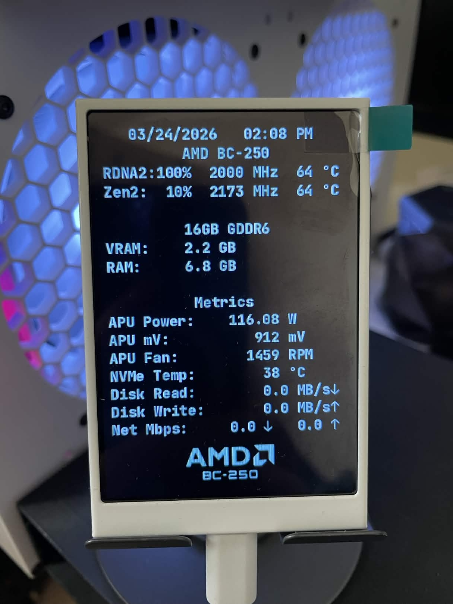
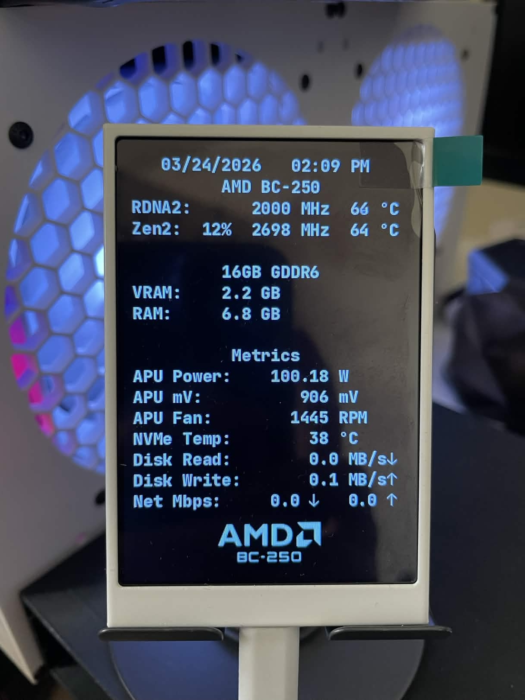
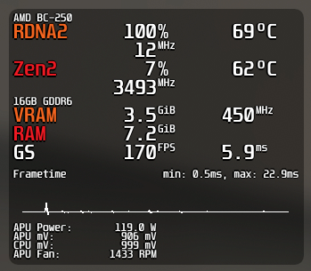
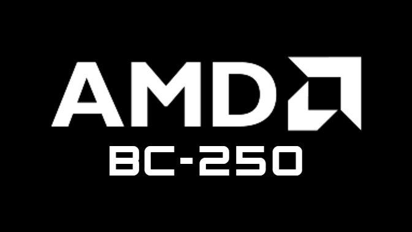
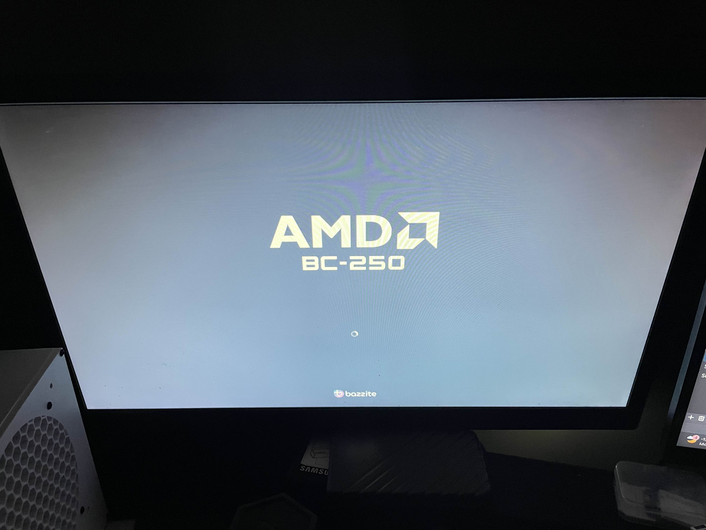

# bc250-custom-overlays
BC250 custom overlays collection. Made by [TMGHD272](https://www.youtube.com/TMGHD272)

A bunch of custom overlays/logos that I made for archival purposes that anyone can use.

## Table of Contents
- [Turzx Screen](#turzx-screen-fully-designed-for-bc250)
  - [With APU Load](#with-apu-load-sensors)
  - [Without APU Load](#without-apu-load-sensors)
  - [Setup Tutorial](#setup-tutorial)
  - [What’s Included](#whats-included)
  - [startup.py Issues](#startuppy-issues)
- [MangoHud](#mangohud-designed-for-bc250)
  - [Setup Tutorial](#setup-tutorial-1)
  - [What’s Included](#whats-included-1)
- [BIOS Logo](#bc250-bios-logo)
  - [BC250 BIOS Logo](https://github.com/tmghd272/bc250-custom-bios-logo)

# Turzx Screen Fully Designed for BC250
A custom-made UI for the Turzx 3.5" screen that detects BC250 sensors:

### With APU Load sensors:
- [download startup.py with APU load](turing-smart-screen/startup.py)

### Without APU Load sensors
(in case you don’t need it or are having trouble fixing 655% on your system):

*Note:* This version without APU Load sensors will be deprecated and stop receiving updates soon.

- [download startup.py without APU load](turing-smart-screen/no-apu-load/startup.py)  

## Setup Tutorial
If you haven’t set up your Turzx screen yet, watch this YT vid by [Old Lamer](https://www.youtube.com/watch?v=vTxWFS8VAcI&t) to set up [turing-smart-screen-python](https://github.com/mathoudebine/turing-smart-screen-python) first

(if needed, make sure to back up your original *startup.py*).

To install my custom overlay, simply put `startup.py` inside:
`/var/home/<username>/Apps/turing-smart-screen-python`

Optional* If you want my custom template background logo I showed in the preview as well, download it [here](turing-smart-screen/example_320x480.png) and simply put `example_320x480.png` inside:

`/var/home/<username>/Apps/turing-smart-screen-python/res/backgrounds`

Then replug the device or run:
`systemctl --user restart turing.service`

## What’s Included
- Date and Time / BC250 Specs

- APU Load, Clock, Temps <- APU  
  Load will always be at 0% without the 655% GPU usage fix script.

- CPU Load, Clock, Temps <- CPU  

- VRAM <- Current APU VRAM usage  

- RAM <- Current system RAM usage  

- APU Power <- Shows your current APU wattage  

- APU mV <- Shows your current APU voltage  

- APU Fan <- Reads `fan2_input` (system RPM)  

- NVMe Temp <- Reads system NVMe temperature  
  (depends if your M.2 SSD supports temp reading)

- Disk Read <- Reads real-time total disk reads  
  (includes NVMe/external drives)

- Disk Write <- Reads real-time total disk writes  
  (includes NVMe/external drives)

- Net Mbps <- Reads download/upload speeds  
  (works on Ethernet/USB Wi-Fi)

### startup.py Issues
If some parts of the sensors weren’t detected, you can open an issue anytime. I will try my best to fix it, but please note I can’t guarantee anything since I’m not an expert. I have tested this on Bazzite/CachyOS and it should technically work fine.

Use `journalctl --user -u turing.service -f` to include your logs.

# MangoHud Designed for BC250
A custom-made MangoHud preset overlay with a BC250/AMD-themed style  
(works with both Desktop/Gaming Mode for Bazzite/Linux with Steam Deck mode)

Download it here (I recommend using both files):
- [MangoHud.conf for Desktop Mode MangoHud Presets](MangoHud/MangoHud.conf)
- [presets.conf for Steam Gaming Mode MangoHud Presets](MangoHud/presets.conf)

### Setup Tutorial
Put `MangoHud.conf` or `presets.conf` inside:
`/var/home/<username>/.config/MangoHud`

Create the "MangoHud" directory if you don’t have one.

### What’s Included
- APU Power <- Shows your current APU wattage  

- APU mV <- Shows your current APU voltage

- APU Fan <- Reads `fan2_input` (system RPM)

# BC250 BIOS Logo
You can download my BC250 BIOS ROM with the custom logo I made here.

- [bc250-amd.rom](https://github.com/tmghd272/bc250-custom-bios-logo/blob/main/bc250-amd.rom)

### Complete Guide: [bc250-custom-bios-logo](https://github.com/tmghd272/bc250-custom-bios-logo)

